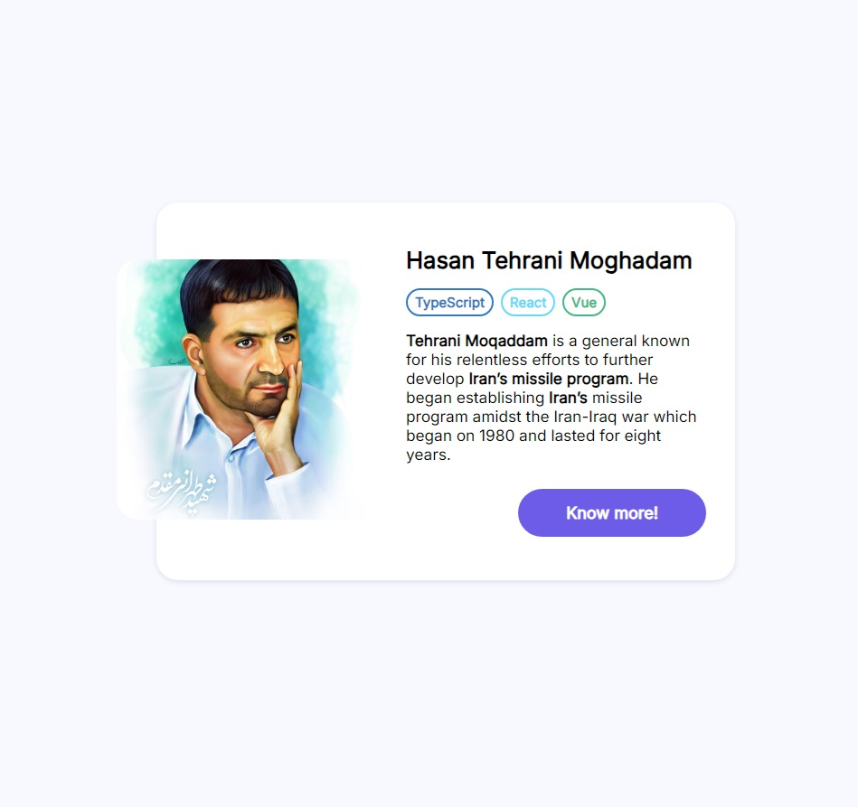
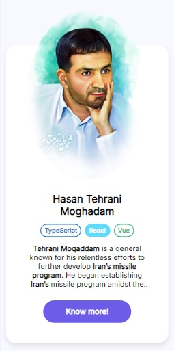

# 🕊️ Profile Card — Hasan Tehrani Moghadam



A responsive and elegant **Profile Card** built with **HTML** and **CSS**, dedicated to **Martyr Hasan Tehrani Moghadam** — known as the *Father of Iran’s Missile Program*.  
He was a visionary scientist, military strategist, and national hero whose dedication and innovation played a crucial role in advancing Iran’s defense capabilities.  
This project serves as both a UI design exercise and a small tribute to his legacy.


## ✨ Overview

This project showcases a **responsive profile card component** designed with a clean and modern interface.  
It features hover interactions, a flexible layout, and easy customization through CSS variables.

🔗 **Live Demo:** [View on GitHub Pages](https://seyedahmaddv.github.io/ui-cards-01/)


## 🎨 Features

- 🖼️ **Profile Picture:** Prominently displays Hasan Tehrani Moghadam’s portrait with smooth hover effects.  
- 🧠 **Skills Section:** Includes icons and links for technologies such as TypeScript, React, and Vue.  
- 📱 **Responsive Layout:** Fully adaptive design optimized for desktop and mobile screens.  
- ✨ **Interactive Hover Effects:** Subtle animations for better engagement.  
- ⚙️ **Easily Customizable:** Modify colors, themes, and content via CSS variables.  


## 🧩 CSS Custom Properties

The component uses CSS variables for consistent theming and easy customization:

```css
:root {
  --primary: #6c5ce7;
  --primary-light: #a29bfe;
  --primary-dark: #4834d4;
  --react: #61dafb;
  --typescript: #3178c6;
  --vue: #42b883;
  --white: #fff;
  --background: #f8f8ff;
  --text: #262626;
}
````

You can adjust these values to fit any color palette or design theme.


## 🧱 Project Structure

| File         | Description                                                                         |
| ------------ | ----------------------------------------------------------------------------------- |
| `index.html` | Main structure of the profile card, including image, name, skills, and description. |
| `style.css`  | Styling and layout rules, including responsive design for various screen sizes.     |
| `assets/`    | Contains images and other media used in the project.                                |

The layout uses **Flexbox** for alignment and spacing, ensuring a minimal and clean appearance.


## ⚙️ How to Use

1. **Clone the Repository**

   ```bash
   git clone https://github.com/seyedahmaddv/ui-cards-01.git
   ```
2. **Open the Project**

   ```bash
   cd ui-cards-01
   ```
3. **Preview**

   * Simply open `index.html` in your browser.
4. **Customize**

   * Edit `style.css` to adjust colors, sizes, or hover effects.
   * Replace the images in the `assets/` folder if desired.


## 🧾 Preview

**Desktop Version:**


**Mobile Version:**




## 🕊️ About Hasan Tehrani Moghadam

**Hasan Tehrani Moghadam (1959 – 2011)** was an Iranian engineer, military commander, and one of the pioneers of Iran’s missile development program.
He devoted his life to innovation, research, and strengthening his country’s defense capabilities. His commitment to science, strategy, and national progress continues to inspire new generations.


## 🖋️ Author

Created with ❤️ by [**Seyed Ahmad Gholami**](https://github.com/seyedahmaddv)
📧 **[seyedahmaddv@gmail.com](mailto:seyedahmaddv@gmail.com)**
🌐 [linkedin.com/in/seyedahmaddv](https://linkedin.com/in/seyedahmaddv)
